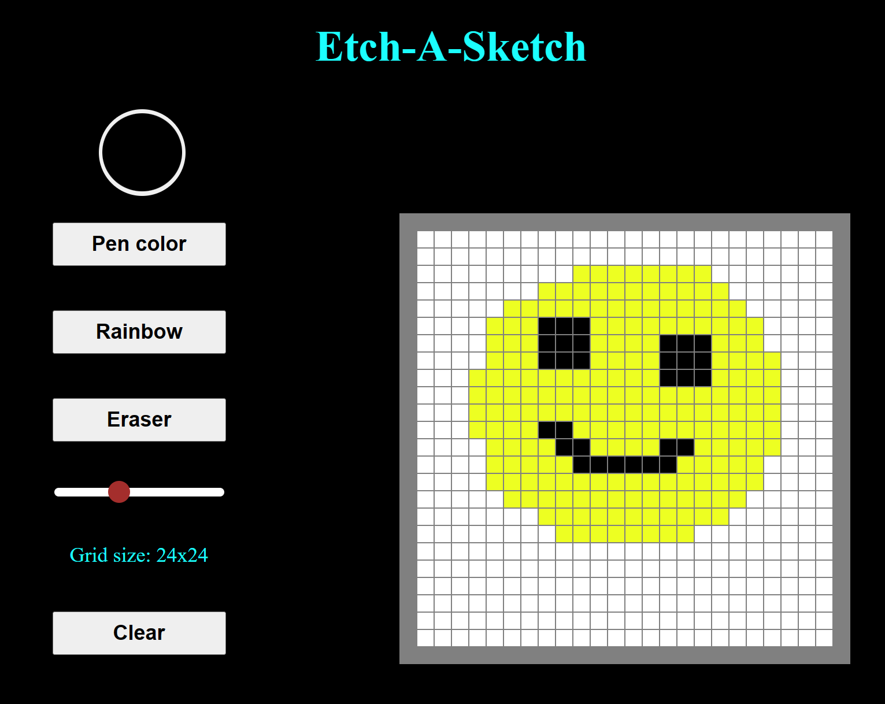

Create your own pixel art:

- Select any colour for the pen.
- Rainbow pen colours each cell a random colour.
- Create a grid size up to 64 x 64.

Feature ideas to implement:

- Shading.
- Lighten.
- Save images.
- Export images.
- Undo.

 [Live site](https://lthd2403.github.io/Etch-A-Sketch/)

 